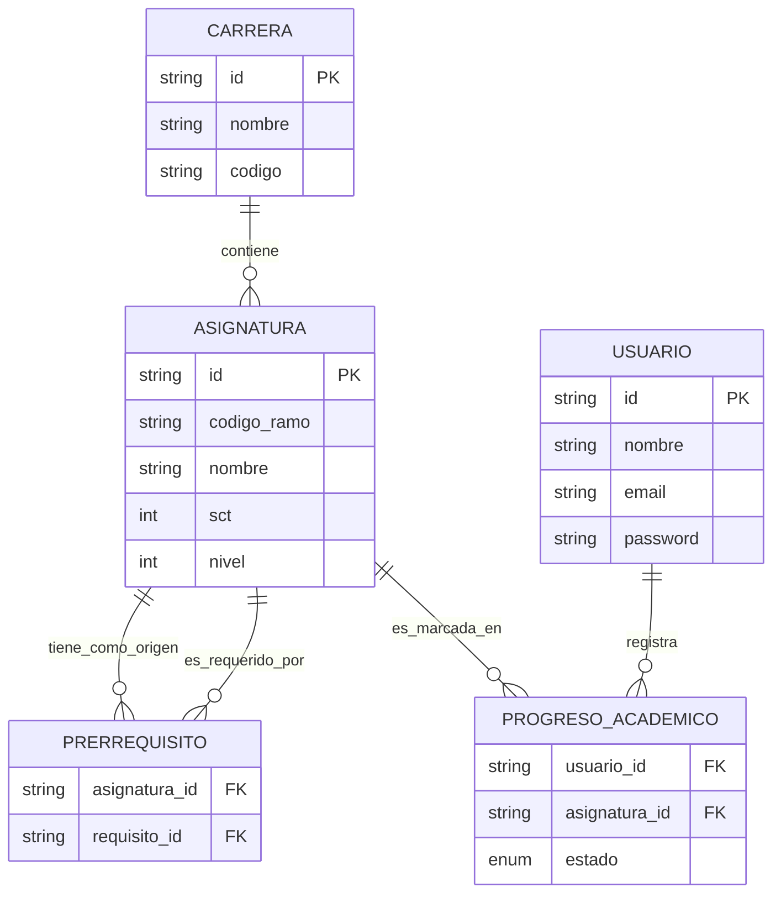

# FRO-Path 🎓

**Visualizador interactivo de progreso académico para las carreras de Ingeniería Informática e Ingeniería Civil Informática de la Universidad de La Frontera (UFRO).**

Este proyecto surge como solución a la dificultad de los estudiantes para visualizar sus prerrequisitos y gestionar su avance curricular de forma intuitiva. El sistema automatiza el seguimiento de la malla y utiliza Inteligencia Artificial para analizar la carga académica basada en los créditos SCT.

---

## 📊 Modelo de Datos (ER Diagram)

Este diagrama representa la estructura de la base de datos que sustenta la lógica de prerrequisitos y el seguimiento de ramos.


## 🛠️ Stack Tecnológico

El proyecto utiliza un entorno de desarrollo moderno basado en **TypeScript** para asegurar la robustez y escalabilidad del sistema.

| Componente | Tecnología | Versión |
| :--- | :--- | :--- |
| **Entorno de Ejecución** | Node.js | v24.14.1 (LTS) |
| **Gestor de Paquetes** | npm | v11.11.0 |
| **Frontend** | React + Vite | v9.0.3 (Vite) |
| **Backend** | NestJS | v11.0.0+ |
| **Base de Datos** | PostgreSQL | 16+ |
| **Lenguaje** | TypeScript | 5.0+ |

---

## ⚖️ Marco Legal y Normativo

El desarrollo de este software observa la legislación chilena y los reglamentos internos de la UFRO:

1. **Propiedad Intelectual:** Según el Art. 8 de la **Ley 17.336**, la titularidad del software desarrollado en contexto académico/laboral corresponde a la universidad. La ley lo protege como obra intelectual (Art. 3, N° 16).
2. **Protección de Datos:** Cumplimiento del Principio de Finalidad (**Ley 19.628**) y estándares de seguridad para evitar filtraciones (**Ley 21.719**).
3. **Transparencia:** Las mallas curriculares son información pública (Art. 12, Reglamento **Ley 20.285**).
4. **Propiedad Industrial:** El uso de marcas institucionales se rige por la **Ley 19.039** y normativas internas de la UFRO (Art. 63, **Ley 21.094**).

---

## 🚀 Instalación y Desarrollo

Para ejecutar el proyecto localmente, asegúrate de tener instalado Node.js v24+.

### Configuración inicial
```bash
git clone https://github.com/jcidvidal/FRO-Path.git
cd FRO-Path
```
### Ejecutar Frontend
```bash
cd client
npm install
npm run dev
```
### Ejecutar Backend
```bash
cd server
npm install
npm run start:dev
```
## 👥 Integrantes del Equipo
- Juan Pablo Cid

- Vicente Hernández

- Maximiliano Rivas

- Benjamín Valenzuela

Proyecto desarrollado para el ramo de Proyecto de Aplicación - UFRO 2026
