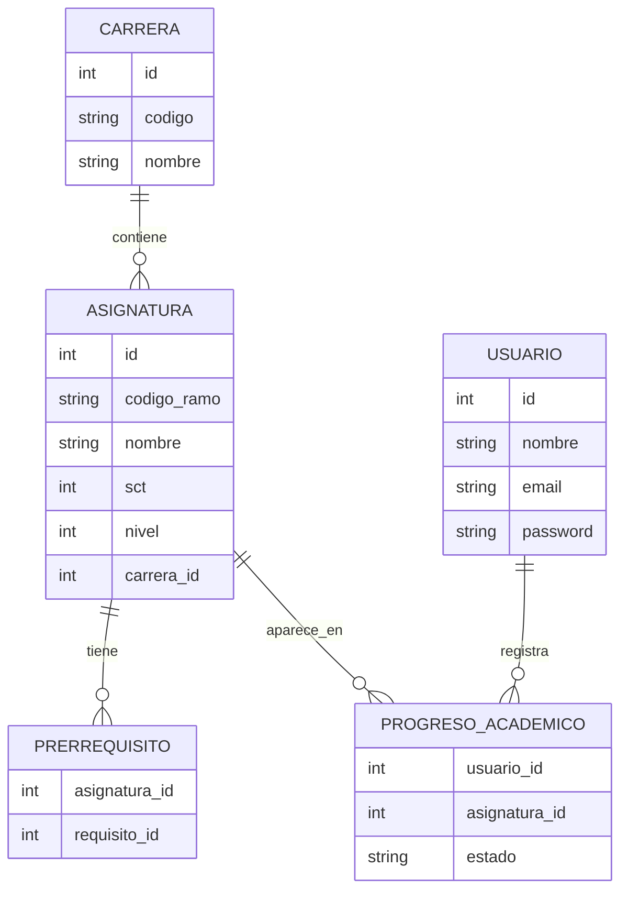

# FRO-Path

## Descripción del Producto

**FRO-Path** es una plataforma web interactiva diseñada para la visualización, simulación y planificación del progreso académico de los estudiantes de las carreras de **Ingeniería Civil Informática (ICI)** e **Ingeniería Informática (II)** de la **Universidad de La Frontera (UFRO)**.

### Características Principales:
- **Visualizador de Malla Curricular:** Interfaz gráfica moderna e interactiva para navegar por los niveles, asignaturas y áreas de conocimiento de la carrera.
- **Simulador de Avance y Prerrequisitos:** Permite a los estudiantes marcar asignaturas como cursando, aprobadas o reprobadas, visualizando dinámicamente qué ramos se desbloquean o bloquean en tiempo real.
- **Cálculo de Créditos SCT:** Seguimiento automático del avance de créditos aprobados en relación con el plan de estudios.
- **Planificador / Orientador por IA (Gemini):** Integración opcional con inteligencia artificial para sugerir una carga académica óptima y personalizada basada en el avance actual y la carga de créditos recomendada.

## Prerrequisitos y Configuración Inicial

Para ejecutar y desarrollar el proyecto de forma local, asegúrate de contar con lo siguiente:

### 1. Requisitos de Software
- **Node.js:** Versión `24.14.1` o superior compatible.
- **npm:** Versión `11.11.0` o superior compatible.
- **Docker & Docker Compose:** Necesario para instanciar la base de datos PostgreSQL de forma local o levantar el entorno completo. *(Asegúrate de que **Docker Desktop** esté abierto y ejecutándose en tu sistema).*

### 2. Configuración de Variables de Entorno (`.env`)
El servidor y la base de datos requieren configuraciones locales para funcionar. Debes crear un archivo `.env` antes de levantar los servicios:
- **Si usas Docker Compose (Opción A):** Crea un archivo `.env` en la raíz del proyecto.
- **Si usas desarrollo local (Opción B):** Copia la plantilla ejecutando `cp apps/server/.env.example apps/server/.env` y configúrala.
- **Clave API de Gemini:** Si deseas el análisis por IA, obtén una clave gratuita en [Google AI Studio](https://aistudio.google.com/apikey) (debe comenzar con `AIzaSy...`) y colócala en `GEMINI_API_KEY`.
- **JWT Secret:** Genera un secreto para la autenticación de usuarios (ej. usando `node -e "console.log(require('crypto').randomBytes(48).toString('hex'))"`).

---

## Comandos Únicos para Levantar Local

### Opción A: Levantar Todo con Docker Compose (Recomendado)
Este comando único levanta la base de datos PostgreSQL, el servidor NestJS y el cliente React en sus respectivos contenedores de forma automatizada:

```bash
docker compose up --build
```
* Una vez levantado:
  * **Frontend (Cliente):** `http://localhost:5173`
  * **Backend (Servidor API):** `http://localhost:3000`

---

### Opción B: Levantar con Scripts Locales (Desarrollo Local)
Si deseas levantar los servicios directamente con Node:

1. **Instalar dependencias:**
   ```bash
   npm run install:all
   ```
2. **Levantar base de datos en segundo plano:**
   ```bash
   docker compose up -d db
   ```
3. **Iniciar el servidor API (Backend - NestJS):**
   ```bash
   npm run dev:server
   ```
4. **Iniciar el cliente web (Frontend - React + Vite):**
   ```bash
   npm run dev:client
   ```

---

## Comandos para Ejecutar Pruebas y Cobertura

Puedes ejecutar las pruebas de cada workspace desde la raíz del proyecto usando los siguientes comandos:

### 1. Servidor Backend (NestJS / Jest)
* **Ejecutar pruebas unitarias:**
  ```bash
  npm run test --workspace=@fro-path/server
  ```
* **Ejecutar cobertura de código (Coverage):**
  ```bash
  npm run test:cov --workspace=@fro-path/server
  ```

### 2. Cliente Frontend (React / Vitest)
* **Ejecutar pruebas unitarias:**
  ```bash
  npm run test --workspace=@fro-path/client
  ```
* **Ejecutar cobertura de código (Coverage):**
  ```bash
  npm run test:coverage --workspace=@fro-path/client
  ```

---

## Configuración de Variables de Entorno (`.env`)

El backend requiere ciertas configuraciones que se definen en el archivo `.env`. Se incluye una plantilla en [apps/server/.env.example](./apps/server/.env.example). 

Para comenzar:
1. Copia el archivo de ejemplo:
   ```bash
   cp apps/server/.env.example apps/server/.env
   ```
2. Si deseas habilitar el análisis de carga académica por IA, obtén una clave de API en [Google AI Studio](https://aistudio.google.com/apikey) y configúrala en el parámetro:
   ```env
   GEMINI_API_KEY=tu-clave-de-api-de-gemini
   ```

Las credenciales por defecto de la base de datos están preconfiguradas para funcionar directamente con el servicio de Docker.

---

## URLs de Despliegue

Actualmente, el proyecto está preparado para su despliegue continuo en la nube:

* **Frontend Web (Vercel):** [https://fro-path-client.vercel.app](https://fro-path-client.vercel.app)
* **Backend API (Despliegue Externo):** [https://fro-path-server.onrender.com](https://fro-path-server.onrender.com)
* **Base de datos (PostgreSQL Cloud):** Hospedada en servicio compatible con TypeORM.

---

## Apartados principales

- `apps/client`: frontend React + Vite.
- `apps/server`: backend NestJS.
- `packages/common`: contratos compartidos entre cliente y servidor.
- `packages/database`: entidades TypeORM y configuracion de PostgreSQL.
- `docs`: documentacion de alcance, requerimientos, viabilidad y decisiones tecnicas.

## Documentacion por apartado

- [Frontend](apps/client.md)
- [Backend](apps/server.md)
- [Cliente React](apps/client/README.md)
- [Servidor NestJS](apps/server/README.md)
- [Contratos compartidos](packages/common/common.md)
- [Base de datos](packages/database/database.md)
- [Alcance](docs/alcance.md)
- [Requerimientos](docs/requerimientos.md)
- [Viabilidad](docs/viabilidad.md)
- [Matriz comparativa](docs/matriz-comparativa.md)
- [Vercel](vercel.md)

## Stack tecnologico

| Componente | Tecnologia |
| :--- | :--- |
| Monorepo | npm workspaces |
| Lenguaje | TypeScript |
| Frontend | React + Vite |
| Backend | NestJS |
| Base de datos | PostgreSQL + TypeORM |
| CI | GitHub Actions |

## Modelo de datos conceptual


```mermaid
erDiagram
    CARRERA ||--o{ ASIGNATURA : contiene
    ASIGNATURA ||--o{ PRERREQUISITO : tiene
    USUARIO ||--o{ PROGRESO_ACADEMICO : registra
    ASIGNATURA ||--o{ PROGRESO_ACADEMICO : aparece_en

    CARRERA {
        int id
        string codigo
        string nombre
    }

    ASIGNATURA {
        int id
        string codigo_ramo
        string nombre
        int sct
        int nivel
        int carrera_id
    }

    PRERREQUISITO {
        int asignatura_id
        int requisito_id
    }

    USUARIO {
        int id
        string nombre
        string email
        string password
    }

    PROGRESO_ACADEMICO {
        int usuario_id
        int asignatura_id
        string estado
    }
```

## Comandos del monorepo

```bash
npm install
npm run install:all
npm run dev:client
npm run dev:server
npm run build
npm run test
```

## Desarrollo local

Para ejecutar el cliente:

```bash
npm run dev:client
```

Para ejecutar el servidor:

```bash
npm run dev:server
```

## CI

El proyecto usa GitHub Actions para validar cambios hacia ramas principales. La intencion del pipeline es instalar dependencias, compilar los workspaces relevantes y ejecutar pruebas antes de integrar cambios.

## Carreras soportadas

La primera version de FRO-Path soporta Ingenieria Civil Informatica (ICI) e Ingenieria Informatica (II). No se incluyen otras carreras en esta version.

## Equipo

Proyecto desarrollado para el ramo de Proyecto de Aplicacion - UFRO 2026.