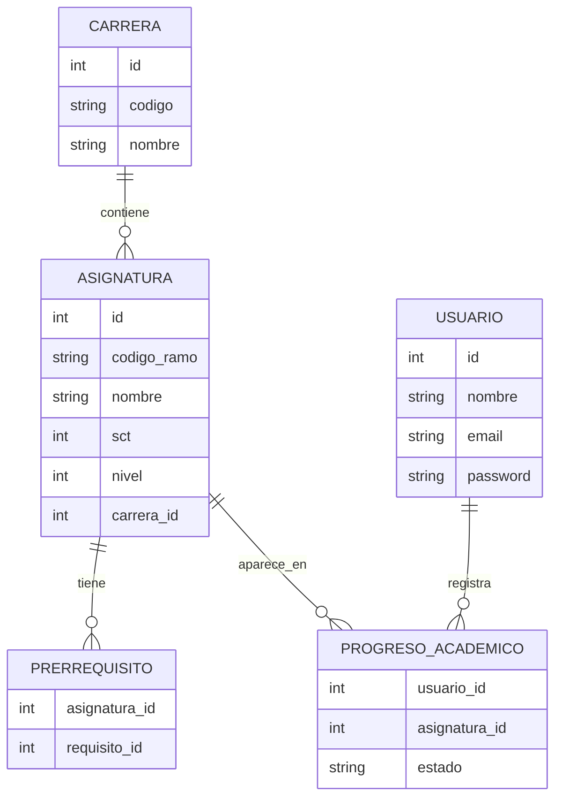

# FRO-Path

Visualizador interactivo de progreso academico para estudiantes de carreras informaticas de la Universidad de La Frontera.

FRO-Path busca ayudar a estudiantes a entender su avance curricular, visualizar prerrequisitos, simular estados de asignaturas y revisar una orientacion de carga academica basada en creditos SCT.

## Apartados principales

- `apps/client`: frontend React + Vite.
- `apps/server`: backend NestJS.
- `packages/common`: contratos compartidos entre cliente y servidor.
- `packages/database`: entidades TypeORM y configuracion de PostgreSQL.
- `docs`: documentacion de alcance, requerimientos, viabilidad y decisiones tecnicas.

## Documentacion por apartado

- [Frontend](apps/client.md)
- [Backend](apps/server.md)
- [Cliente React](apps/client/README.md)
- [Servidor NestJS](apps/server/README.md)
- [Contratos compartidos](packages/common/common.md)
- [Base de datos](packages/database/database.md)
- [Alcance](docs/alcance.md)
- [Requerimientos](docs/requerimientos.md)
- [Viabilidad](docs/viabilidad.md)
- [Matriz comparativa](docs/matriz-comparativa.md)
- [Vercel](vercel.md)

## Stack tecnologico

| Componente | Tecnologia |
| :--- | :--- |
| Monorepo | npm workspaces |
| Lenguaje | TypeScript |
| Frontend | React + Vite |
| Backend | NestJS |
| Base de datos | PostgreSQL + TypeORM |
| CI | GitHub Actions |

## Modelo de datos conceptual


```mermaid
erDiagram
    CARRERA ||--o{ ASIGNATURA : contiene
    ASIGNATURA ||--o{ PRERREQUISITO : tiene
    USUARIO ||--o{ PROGRESO_ACADEMICO : registra
    ASIGNATURA ||--o{ PROGRESO_ACADEMICO : aparece_en

    CARRERA {
        int id
        string codigo
        string nombre
    }

    ASIGNATURA {
        int id
        string codigo_ramo
        string nombre
        int sct
        int nivel
        int carrera_id
    }

    PRERREQUISITO {
        int asignatura_id
        int requisito_id
    }

    USUARIO {
        int id
        string nombre
        string email
        string password
    }

    PROGRESO_ACADEMICO {
        int usuario_id
        int asignatura_id
        string estado
    }
```

## Comandos del monorepo

```bash
npm install
npm run install:all
npm run dev:client
npm run dev:server
npm run build
npm run test
```

## Desarrollo local

Para ejecutar el cliente:

```bash
npm run dev:client
```

Para ejecutar el servidor:

```bash
npm run dev:server
```

## CI

El proyecto usa GitHub Actions para validar cambios hacia ramas principales. La intencion del pipeline es instalar dependencias, compilar los workspaces relevantes y ejecutar pruebas antes de integrar cambios.

## Decision pendiente

La documentacion historica menciona distintas combinaciones de carreras soportadas: ICC/ICI e ICC/II. Antes de cerrar la primera version se debe confirmar oficialmente que carreras se incluiran.

## Equipo

Proyecto desarrollado para el ramo de Proyecto de Aplicacion - UFRO 2026.
